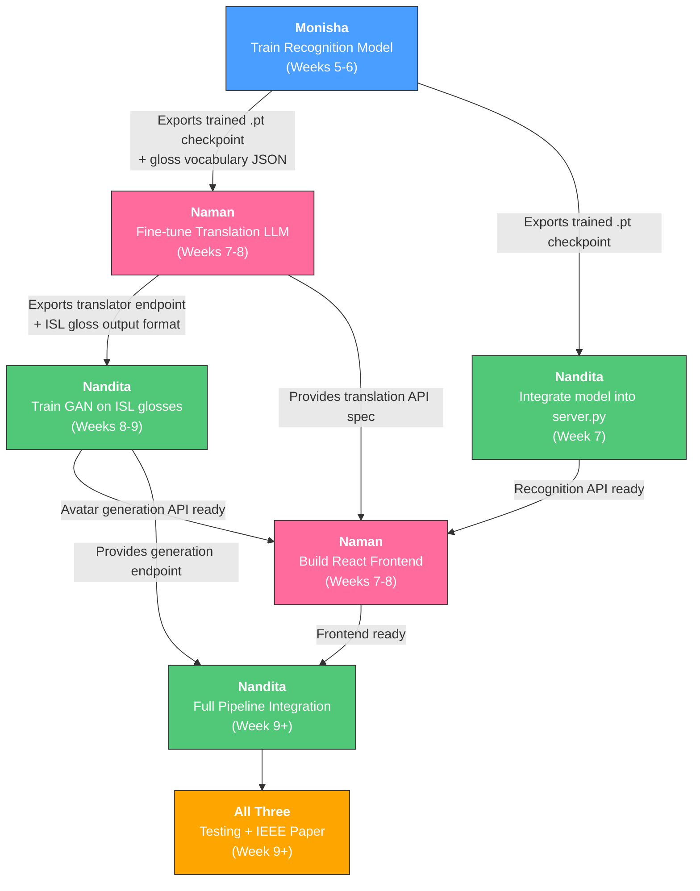

# AITE — Remaining Work Breakdown

**Remaining Phases:** Weeks 5–9+ | **Start Date:** Week 5 (current)

---

## Dependency Overview



> [!IMPORTANT]
> **Critical Path:** Monisha's recognition model training (Weeks 5–6) is the single most critical dependency. Both Naman's translation work and Nandita's server integration are blocked until the trained checkpoint is available. **Monisha must deliver the checkpoint by end of Week 6.**

---

## 🔵 Monisha Sharma — Recognition & Training Lead

### Ownership

| Files Owned | Config |
|---|---|
| [model.py](file:///d:/Languages/Project/IEEE/Implementation/ASL-ISL/src/recognition/model.py) | [recognition.yaml](file:///d:/Languages/Project/IEEE/Implementation/ASL-ISL/configs/recognition.yaml) |
| [dataset.py](file:///d:/Languages/Project/IEEE/Implementation/ASL-ISL/src/recognition/dataset.py) | |
| [preprocess.py](file:///d:/Languages/Project/IEEE/Implementation/ASL-ISL/src/recognition/preprocess.py) | |
| `scripts/train_recognition.py` **(NEW)** | |
| `notebooks/training_analysis.ipynb` **(NEW)** | |

---

### Task N1: Upgrade Preprocessing Pipeline (Week 5, Days 1–2)

**Goal:** Implement the 27-node graph reduction (from Jiang et al.) and signing-space normalisation (from Boháček & Hrúz) into the existing preprocessing pipeline.

**Step-by-step:**

1. **Modify** [preprocess.py](file:///d:/Languages/Project/IEEE/Implementation/ASL-ISL/src/recognition/preprocess.py) — the current `HandKeypointExtractor` only extracts raw 21-hand keypoints. Upgrade it to:
   - Switch from `mp.solutions.hands` to `mp.solutions.holistic` to also capture upper-body pose landmarks
   - Implement the **27-node graph selection**: 10 nodes per hand (tips + MCP joints of all 5 fingers) + 7 upper-body nodes (shoulders, elbows, wrists, nose)
   - Implement **signing-space normalisation**: compute the head metric (half the shoulder distance), define a 6×7 head-unit bounding box centred on the nose, and remap all coordinates to `[-0.5, 0.5]`
   - Add horizontal mirroring augmentation (flip left↔right) for robustness to handedness (from Ingoley & Bakal)

2. **Update** [recognition.yaml](file:///d:/Languages/Project/IEEE/Implementation/ASL-ISL/configs/recognition.yaml):
   - Change `num_keypoints: 21` → `num_keypoints: 27`
   - Add augmentation parameters: `mirror_prob: 0.5`, `rotation_range: 13`, `squeeze_ratio: 0.15`

3. **Update** [dataset.py](file:///d:/Languages/Project/IEEE/Implementation/ASL-ISL/src/recognition/dataset.py):
   - Modify `_sample_frames()` to use the upgraded extractor that returns 27 keypoints × 3 coordinates
   - Add the augmentation transforms (rotation, squeeze, mirror) as a `transform` parameter

4. **Test:** Run the existing [test_preprocess.py](file:///d:/Languages/Project/IEEE/Implementation/ASL-ISL/tests/test_preprocess.py) and verify the output shape changes from `(21, 3)` to `(27, 3)`.

> [!WARNING]
> **Dependency handoff to Naman:** After updating `preprocess.py`, immediately notify Naman because her [feature_extractor.py](file:///d:/Languages/Project/IEEE/Implementation/ASL-ISL/src/utils/feature_extractor.py) imports `HandKeypointExtractor` from this file. She needs to update the zero-padding shape from `(21, 3)` to `(27, 3)` in `feature_extractor.py` lines 33, 37, and 76.

---

### Task N2: Upgrade the Transformer Architecture (Week 5, Days 2–3)

**Goal:** Enhance the skeleton model in [model.py](file:///d:/Languages/Project/IEEE/Implementation/ASL-ISL/src/recognition/model.py) from the current basic wrapper into a proper SPOTER-like architecture.

**Step-by-step:**

1. **Modify** [model.py](file:///d:/Languages/Project/IEEE/Implementation/ASL-ISL/src/recognition/model.py):
   - Update `input_proj` from `nn.Linear(num_keypoints * 3, d_model)` to `nn.Linear(27 * 3, d_model)` (= 81 input features)
   - Add **positional encoding** (sinusoidal) for the temporal frame dimension
   - Replace the full encoder-decoder with an **encoder-only** architecture + **Class Query** decoder head (a single learnable query token attended over the encoder output, inspired by SPOTER)
   - Add dropout layers between encoder and output projection
   - Target: ~5.9M parameters (monitor with `sum(p.numel() for p in model.parameters())`)

2. **Create** `scripts/train_recognition.py` — the training loop:
   - Load WLASL dataset via `WLASLDataset` from `dataset.py`
   - Use `Adam` optimiser with `lr=1e-4`, `weight_decay=1e-4`
   - Use `StepLR` scheduler (step=10, gamma=0.9)
   - Use `CrossEntropyLoss` for word-level classification
   - Save best checkpoint to `models/recognition/best_model.pt`
   - Log training/validation loss and accuracy per epoch to a CSV file: `models/recognition/training_log.csv`
   - Start with WLASL-100 (100 classes) for fast iteration, then scale to WLASL-300 and WLASL-2000

3. **Update** [recognition.yaml](file:///d:/Languages/Project/IEEE/Implementation/ASL-ISL/configs/recognition.yaml) with the new architecture params.

---

### Task N3: Train and Evaluate the Model (Weeks 5–6)

**Goal:** Achieve a usable recognition accuracy on WLASL and generate evaluation metrics.

**Step-by-step:**

1. **Download WLASL** dataset from Kaggle to `data/wlasl/`:
   ```
   data/wlasl/
   ├── videos/          # Raw video files
   ├── WLASL_v0.3.json  # Annotations
   └── processed/       # Extracted keypoint .npy files (generated by feature_extractor.py)
   ```

2. **Run feature extraction** batch job:
   ```bash
   python -m src.utils.feature_extractor --video_dir data/wlasl/videos --annotation_file data/wlasl/WLASL_v0.3.json --output_dir data/wlasl/processed
   ```

3. **Train the model:**
   ```bash
   python scripts/train_recognition.py --config configs/recognition.yaml
   ```

4. **Evaluate** using WER (Word Error Rate) from [metrics.py](file:///d:/Languages/Project/IEEE/Implementation/ASL-ISL/src/utils/metrics.py). Target: **WER < 30%** on WLASL-100 validation set.

5. **Export deliverables** (these are required by both Naman and Nandita):

   | Deliverable | Path | Needed By |
   |---|---|---|
   | Trained model checkpoint | `models/recognition/best_model.pt` | Nandita (Task D2) |
   | Gloss vocabulary JSON | `models/recognition/gloss_vocab.json` | Naman (Task M1) |
   | Training log CSV | `models/recognition/training_log.csv` | All (IEEE paper) |
   | WER evaluation results | `models/recognition/eval_results.json` | All (IEEE paper) |

> [!CAUTION]
> **Hard deadline: End of Week 6.** Both Naman and Nandita are blocked without the checkpoint and vocabulary file. If training takes longer than expected, export an intermediate checkpoint (even with suboptimal accuracy) so the team can begin integration in parallel.

---

### Task N4: IEEE Paper Sections (Week 9+)

**Sections to draft:**
- **Section III: Methodology** — Recognition pipeline architecture, preprocessing, augmentation
- **Section V-A: Recognition Results** — Training curves, WER tables, ablation studies (with/without normalisation, with/without graph reduction)
- **Section V-C: System Performance** — Inference latency benchmarks (FPS on CPU vs GPU)

**Files to create:** `docs/paper_sections/methodology.md`, `docs/paper_sections/recognition_results.md`

---

## 🔴 Naman Nagar — Translation & Frontend Lead

### Ownership

| Files Owned | Config |
|---|---|
| [translator.py](file:///d:/Languages/Project/IEEE/Implementation/ASL-ISL/src/translation/translator.py) | [translation.yaml](file:///d:/Languages/Project/IEEE/Implementation/ASL-ISL/configs/translation.yaml) |
| [feature_extractor.py](file:///d:/Languages/Project/IEEE/Implementation/ASL-ISL/src/utils/feature_extractor.py) | |
| [mediapipe_demo.py](file:///d:/Languages/Project/IEEE/Implementation/ASL-ISL/src/utils/mediapipe_demo.py) | |
| `frontend/` **(NEW — entire directory)** | |

---

### Task M0: Sync with Monisha's Preprocessing Update (Week 5, Day 2)

> [!IMPORTANT]
> **Dependency: Blocked until Monisha completes Task N1.**

When Monisha notifies you that `preprocess.py` is updated:

1. **Update** [feature_extractor.py](file:///d:/Languages/Project/IEEE/Implementation/ASL-ISL/src/utils/feature_extractor.py):
   - Line 33: Change `np.zeros((21, 3))` → `np.zeros((27, 3))`
   - Line 37: Change `np.zeros((21, 3))` → `np.zeros((27, 3))`
   - Line 76: Change `np.zeros((21, 3))` → `np.zeros((27, 3))`
2. **Test** that `extract_from_video()` returns shape `(num_frames, 27, 3)` instead of `(num_frames, 21, 3)`.

**While waiting** for Monisha (Week 5): Start Task M2 (React frontend scaffold) — it has no dependencies.

---

### Task M1: Build the ASL→ISL Translation Module (Weeks 7–8)

> [!IMPORTANT]
> **Dependency: Requires `gloss_vocab.json` from Monisha (Task N3).** The vocabulary file defines the exact gloss labels the recognition model outputs, which the translator must accept as input.

**Goal:** Upgrade [translator.py](file:///d:/Languages/Project/IEEE/Implementation/ASL-ISL/src/translation/translator.py) from the current 4-line skeleton into a production-grade ASL→ISL grammar translator.

**Step-by-step:**

1. **Design the grammar mapping rules.** ASL uses Subject-Verb-Object (SVO) order; ISL uses Subject-Object-Verb (SOV). Key transformations:
   - Word order restructuring: `"I WANT FOOD"` (ASL) → `"I FOOD WANT"` (ISL)
   - Negation placement: ASL uses head shake + sign; ISL places negation marker after verb
   - Question formation: ASL uses eyebrow raise; ISL uses specific question markers
   - Create a rule-based mapping table in `configs/grammar_rules.json`

2. **Implement POS-tag placeholders** (from the Talking Faces paper):
   - Before sending to LLM: replace proper nouns with `<PROPN>`, numbers with `<NUM>`
   - After LLM output: restore original tokens from a lookup cache
   - This prevents vocabulary explosion in the quantized model

3. **Implement filler-word filtering** (from Diksha Rade et al.):
   - Create a stopword/filler list specific to sign language glosses
   - Filter out `UM`, `UH`, `LIKE`, `SO` etc. before translation

4. **Upgrade the LLM pipeline** in `translator.py`:
   - Add prompt engineering with few-shot ASL→ISL examples in the system prompt
   - Add temperature/top-p controls via `configs/translation.yaml`
   - Add a `validate_output()` method that checks the ISL gloss output against known ISL vocabulary
   - Implement batch translation for multiple glosses

5. **Create evaluation script** `scripts/eval_translation.py`:
   - Use the `Metrics` class from [metrics.py](file:///d:/Languages/Project/IEEE/Implementation/ASL-ISL/src/utils/metrics.py) to compute BLEU-4 scores
   - Create a test set of 50+ manually verified ASL→ISL pairs
   - Target: **BLEU-4 > 20** on the test set

**Deliverables for Nandita:**

| Deliverable | Path | Needed By |
|---|---|---|
| Working `translate(asl_gloss) → isl_gloss` function | `src/translation/translator.py` | Nandita (Task D3) |
| ISL gloss vocabulary list | `configs/isl_vocabulary.json` | Nandita (Task D3) |
| Translation API endpoint spec | Documented in code | Nandita (Task D4) |

---

### Task M2: Build the React Frontend (Weeks 5–8, in phases)

**Goal:** Create a web UI for webcam capture, real-time sign display, and translation output.

**Phase 1 — Scaffold (Week 5, no dependencies):**
1. Initialise a Vite + React project in `frontend/`:
   ```bash
   cd frontend && npx -y create-vite@latest ./ --template react
   ```
2. Set up project structure:
   ```
   frontend/src/
   ├── components/
   │   ├── WebcamCapture.jsx     # Webcam video feed
   │   ├── KeypointOverlay.jsx   # MediaPipe landmark visualisation
   │   ├── TranslationPanel.jsx  # ASL gloss → ISL gloss display
   │   └── AvatarDisplay.jsx     # ISL avatar animation viewer
   ├── services/
   │   └── api.js                # API calls to FastAPI backend
   ├── App.jsx
   └── main.jsx
   ```
3. Implement `WebcamCapture.jsx` using `navigator.mediaDevices.getUserMedia()`
4. Add basic CSS styling (dark theme, glassmorphism cards)

**Phase 2 — API Integration (Week 7, after Nandita's server endpoints are live):**

> [!IMPORTANT]
> **Dependency: Requires Nandita to complete Task D2 (recognition endpoint) before API integration.**

1. Connect `WebcamCapture` to the `/predict-gloss` endpoint via `api.js`
2. Display recognised ASL gloss in `TranslationPanel`
3. Connect to the `/translate` endpoint (once Naman's own translator is ready)
4. Display ISL gloss output

**Phase 3 — Avatar Display (Week 9, after Nandita's avatar endpoint is live):**

> [!IMPORTANT]
> **Dependency: Requires Nandita to complete Task D3 (generation endpoint).**

1. Connect `AvatarDisplay` to the `/generate-avatar` endpoint
2. Render the generated pose sequence as a 2D skeleton animation using HTML5 Canvas
3. Add playback controls (play, pause, speed)

---

### Task M3: IEEE Paper Sections (Week 9+)

**Sections to draft:**
- **Section IV: Linguistic Mapping** — ASL→ISL grammar rules, POS-tag methodology, few-shot prompt design
- **Section V-B: NLP Evaluation** — BLEU-4 scores, translation accuracy tables, example translations
- **Section VI-A: Web Interface** — UI screenshots, user flow diagram

**Files to create:** `docs/paper_sections/linguistic_mapping.md`, `docs/paper_sections/nlp_evaluation.md`

---

## 🟢 Nandita R Nadig — Generation & Integration Lead

### Ownership

| Files Owned | Config |
|---|---|
| [avatar.py](file:///d:/Languages/Project/IEEE/Implementation/ASL-ISL/src/generation/avatar.py) | [generation.yaml](file:///d:/Languages/Project/IEEE/Implementation/ASL-ISL/configs/generation.yaml) |
| [server.py](file:///d:/Languages/Project/IEEE/Implementation/ASL-ISL/src/api/server.py) | |
| [video.py](file:///d:/Languages/Project/IEEE/Implementation/ASL-ISL/src/utils/video.py) | |
| [metrics.py](file:///d:/Languages/Project/IEEE/Implementation/ASL-ISL/src/utils/metrics.py) | |
| `scripts/setup_datasets.py` | |
| `scripts/train_avatar.py` **(NEW)** | |

---

### Task D1: Data Engineering & Augmentation Pipeline (Weeks 5–6, parallel with Monisha)

**Goal:** Prepare and preprocess the ISL-CSLGR dataset for both translation and avatar generation training. **No dependencies — start immediately.**

**Step-by-step:**

1. **Download ISL-CSLGR dataset** from Kaggle to `data/isl/`:
   ```
   data/isl/
   ├── videos/          # Raw ISL gesture videos
   ├── annotations.json # Labels and gloss info
   └── processed/       # Extracted keypoint .npy files
   ```

2. **Run batch feature extraction** on ISL videos using the existing `BatchFeatureExtractor`:
   ```bash
   python -m src.utils.feature_extractor --video_dir data/isl/videos --annotation_file data/isl/annotations.json --output_dir data/isl/processed
   ```

3. **Implement data augmentation** in a new file `src/utils/augmentation.py`:
   - **Horizontal mirroring** (left↔right flip) — doubles the dataset for handedness robustness
   - **Temporal jitter** — randomly drop/duplicate 1–2 frames to simulate variable frame rates
   - **Gaussian noise injection** (σ=0.01) on keypoint coordinates — from Saunders et al. (Progressive Transformers)
   - **Scale augmentation** — randomly scale coordinates by ±10%

4. **Create paired ASL-ISL training data** for the translation module:
   - Manually create `data/paired/asl_isl_pairs.json` with 50+ verified ASL↔ISL gloss pairs
   - Format: `[{"asl": "I WANT FOOD", "isl": "I FOOD WANT"}, ...]`
   - This file is needed by **Naman for Task M1**

> [!TIP]
> **Handoff to Naman:** Share `data/paired/asl_isl_pairs.json` as soon as it's ready (ideally by end of Week 5). She needs it to build the grammar rule mappings and evaluate translation quality.

---

### Task D2: Integrate Recognition Model into Server (Week 7)

> [!IMPORTANT]
> **Dependency: Blocked until Monisha delivers `best_model.pt` and `gloss_vocab.json` (Task N3, end of Week 6).**

**Goal:** Upgrade [server.py](file:///d:/Languages/Project/IEEE/Implementation/ASL-ISL/src/api/server.py) from returning raw keypoints to returning actual ASL gloss predictions.

**Step-by-step:**

1. **Load the trained model** at server startup:
   ```python
   # In server.py, add at module level:
   from src.recognition.model import SignRecognitionTransformer
   import json

   model = SignRecognitionTransformer(num_keypoints=27, vocab_size=100)  # Match Monisha's config
   model.load_state_dict(torch.load("models/recognition/best_model.pt"))
   model.eval()

   with open("models/recognition/gloss_vocab.json") as f:
       gloss_vocab = json.load(f)  # {index: "gloss_word", ...}
   ```

2. **Update the `/predict-gloss` endpoint** (currently lines 35–46 of `server.py`):
   - Extract keypoints from uploaded frame
   - Run inference through the loaded model
   - Return the predicted ASL gloss label + confidence score:
     ```json
     {"gloss": "HELLO", "confidence": 0.94, "keypoints": [...]}
     ```

3. **Add a new `/predict-sequence` endpoint** for multi-frame video input:
   - Accept video file upload
   - Extract keypoints from all sampled frames
   - Run batch inference
   - Return a sequence of predicted glosses:
     ```json
     {"glosses": ["HELLO", "MY", "NAME", "IS"], "confidences": [0.94, 0.87, 0.91, 0.82]}
     ```

4. **Add CORS middleware** for the React frontend:
   ```python
   from fastapi.middleware.cors import CORSMiddleware
   app.add_middleware(CORSMiddleware, allow_origins=["http://localhost:5173"], ...)
   ```

**Notify Naman** when these endpoints are live — she needs them for Task M2 Phase 2.

---

### Task D3: Train the GAN Avatar Generator (Weeks 8–9)

> [!IMPORTANT]
> **Dependency: Requires `isl_vocabulary.json` from Naman (Task M1) to know which ISL glosses the GAN must generate. Also requires the processed ISL keypoint data from Task D1.**

**Goal:** Upgrade [avatar.py](file:///d:/Languages/Project/IEEE/Implementation/ASL-ISL/src/generation/avatar.py) from the current generic GAN skeleton into a sign-language-specific pose generator.

**Step-by-step:**

1. **Redesign the Generator architecture** in `avatar.py`:
   - Change from an image-based GAN (ConvTranspose2d outputting 256×256 RGB) to a **pose sequence generator**
   - Input: ISL gloss embedding (from a learned embedding table) + latent noise vector
   - Output: A sequence of 27 keypoint coordinates × T frames (variable length)
   - Implement **Counter Decoding** (from Saunders et al.): append a continuous counter $[0.0 \to 1.0]$ to each frame's embedding; generation stops when counter reaches 1.0
   - Implement **Stop Detection** sigmoid module (from Gil-Martín et al.): a parallel FC layer that predicts end-of-sequence probability per frame

2. **Redesign the Discriminator**:
   - Change from image-based (Conv2d) to sequence-based (1D convolutions or Transformer encoder)
   - Input: a sequence of 27-keypoint frames
   - Output: real/fake probability

3. **Implement Linear Frame Interpolation** (from Gil-Martín et al.):
   - After the Generator produces a raw keypoint sequence, insert 2 interpolated intermediate frames between each pair of consecutive sign segments
   - Use linear interpolation: `frame_mid = (frame_i + frame_{i+1}) / 2`

4. **Create** `scripts/train_avatar.py`:
   - Load processed ISL keypoint sequences from `data/isl/processed/`
   - Train with adversarial loss + L1 reconstruction loss + counter loss
   - Apply Gaussian noise augmentation during training (σ=0.01)
   - Save checkpoints to `models/generation/`

5. **Evaluate** using DTW (Dynamic Time Warping) alignment error against ground truth sequences.

---

### Task D4: Full Pipeline Integration (Week 9)

> [!IMPORTANT]
> **Dependency: Requires all three stages to be functional — Monisha's recognition, Naman's translation, and Nandita's avatar generation.**

**Goal:** Wire the complete end-to-end pipeline in [server.py](file:///d:/Languages/Project/IEEE/Implementation/ASL-ISL/src/api/server.py).

**Step-by-step:**

1. **Add the translation endpoint** to `server.py`:
   ```python
   from src.translation.translator import ASLtoISLTranslator
   translator = ASLtoISLTranslator()

   @app.post("/translate")
   async def translate_gloss(asl_gloss: str):
       isl_gloss = translator.translate(asl_gloss)
       return {"asl_input": asl_gloss, "isl_output": isl_gloss}
   ```

2. **Add the avatar generation endpoint**:
   ```python
   @app.post("/generate-avatar")
   async def generate_avatar(isl_gloss: str):
       pose_sequence = avatar_model.generate(isl_gloss)
       interpolated = apply_frame_interpolation(pose_sequence)
       return {"frames": interpolated.tolist(), "num_frames": len(interpolated)}
   ```

3. **Add a unified `/pipeline` endpoint** that chains all three stages:
   ```python
   @app.post("/pipeline")
   async def full_pipeline(file: UploadFile):
       # Stage 1: Recognition
       keypoints = extract_keypoints(frame)
       asl_gloss = model.predict(keypoints)
       # Stage 2: Translation
       isl_gloss = translator.translate(asl_gloss)
       # Stage 3: Generation
       avatar_frames = avatar_model.generate(isl_gloss)
       return {"asl_gloss": asl_gloss, "isl_gloss": isl_gloss, "avatar_frames": avatar_frames}
   ```

4. **Add latency benchmarking** middleware to log per-request timing for each stage.

5. **Notify Naman** that all endpoints are live — she connects the React frontend in Task M2 Phase 3.

---

### Task D5: IEEE Paper Sections (Week 9+)

**Sections to draft:**
- **Section IV-B: Generative Models** — GAN architecture, Counter Decoding, frame interpolation, stop detection
- **Section V-D: User Feedback & Comparative Results** — DTW scores, latency benchmarks, visual quality comparison
- **Section VI-B: System Architecture** — Full pipeline diagram, API spec, deployment architecture

**Files to create:** `docs/paper_sections/generative_models.md`, `docs/paper_sections/system_architecture.md`

---

## Timeline — Parallel Execution Map

```
Week 5
├── Monisha:    [N1] Upgrade preprocessing ──→ [N2] Upgrade Transformer architecture
├── Naman:  [M0] Wait for N1 sync ──→ [M2-P1] Scaffold React frontend (NO dependency)
└── Nandita:  [D1] Download ISL data + augmentation pipeline + paired data (NO dependency)

Week 6
├── Monisha:    [N3] Train recognition model on WLASL ──→ ⚡ EXPORT checkpoint + vocab ⚡
├── Naman:  [M2-P1] Continue frontend development (WebcamCapture, styling)
└── Nandita:  [D1] Continue data processing + share paired ASL-ISL data with Naman

Week 7
├── Monisha:    [N3] Continue training / hyperparameter tuning + evaluate WER
├── Naman:  [M1] Build ASL→ISL translation module (uses vocab from Monisha)
└── Nandita:  [D2] Integrate recognition model into server.py (uses checkpoint from Monisha)

Week 8
├── Monisha:    Final model refinement + start IEEE paper sections
├── Naman:  [M1] Continue translation + [M2-P2] Connect frontend to recognition API
└── Nandita:  [D3] Redesign + train GAN avatar generator (uses ISL vocab from Naman)

Week 9+
├── Monisha:    [N4] IEEE paper: Methodology + Recognition Results
├── Naman:  [M2-P3] Connect frontend to avatar API + [M3] IEEE paper sections
└── Nandita:  [D4] Full pipeline integration + [D5] IEEE paper sections

Final Sprint
└── All:      End-to-end testing, user evaluation, IEEE paper assembly + review
```

---

## Handoff Protocol — Summary Table

| From | To | What | Format | Deadline | Blocks |
|---|---|---|---|---|---|
| **Monisha** | **Naman** | `preprocess.py` API change (21→27 keypoints) | Code commit + Slack message | Week 5 Day 2 | Task M0 |
| **Monisha** | **Naman** | `gloss_vocab.json` (ASL vocabulary) | JSON file in `models/recognition/` | End of Week 6 | Task M1 |
| **Monisha** | **Nandita** | `best_model.pt` (trained checkpoint) | `.pt` file in `models/recognition/` | End of Week 6 | Task D2 |
| **Nandita** | **Naman** | `asl_isl_pairs.json` (paired training data) | JSON file in `data/paired/` | End of Week 5 | Task M1 |
| **Nandita** | **Naman** | Recognition API endpoints live | Server running on `localhost:8000` | Week 7 | Task M2-P2 |
| **Naman** | **Nandita** | `isl_vocabulary.json` + working translator | JSON file + importable module | End of Week 8 | Task D3 |
| **Nandita** | **Naman** | Avatar generation endpoint live | Server running on `localhost:8000` | Week 9 | Task M2-P3 |

---

## Communication Rules

1. **Daily standups** — 15 min sync on blockers and progress (can be async via Slack/WhatsApp)
2. **Commit messages** must prefix with owner tag: `[monisha]`, `[naman]`, `[nandita]`
3. **Blocking handoffs** — the delivering person must create a **Git tag** (e.g., `v0.2-recognition-checkpoint`) and notify the dependent person directly
4. **If a deadline slips** — export an intermediate/partial deliverable and notify immediately. Do NOT wait in silence.
5. **Shared files** (e.g., `metrics.py`, `server.py` after integration) — coordinate edits via Pull Requests, never push directly to `main`

---

## IEEE Paper Section Ownership — Final Split

| Section | Owner | Dependencies |
|---|---|---|
| I. Introduction | All (joint) | — |
| II. Literature Review | All (from `review.md`) | Already complete |
| III. Methodology — Recognition Pipeline | **Monisha** | Training results |
| IV-A. Linguistic Mapping — Translation | **Naman** | BLEU-4 scores |
| IV-B. Generative Models — Avatar | **Nandita** | DTW scores |
| V-A. Recognition Results (WER) | **Monisha** | Training logs |
| V-B. NLP Evaluation (BLEU) | **Naman** | Translation test set |
| V-C. System Performance (Latency) | **Nandita** | Benchmarking data |
| V-D. User Feedback | **Nandita** | User study |
| VI. System Architecture & UI | **Naman** (UI) + **Nandita** (Backend) | Working demo |
| VII. Conclusion & Future Work | All (joint) | — |
| References | All (joint) | — |
